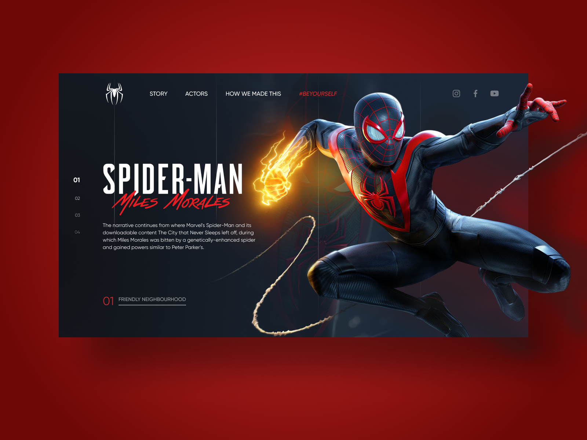

# Spider-man :: Miles Morales

Projeto desenvolvido durante a **#FrontWeek**. Partindo da criação UI Design no Figma, desenvolvimento de toda a estrutura da página com HTML, Sass e JS e aplicando conceitos de animação SVG e transições com a biblioteca GSPAP.

**Acesse o site do projeto em:** https://spider-man-roan.vercel.app/

## Ferramentas utilizadas:

   

  
**Créditos:** #ProjectNY | <a target="_blank" href="https://www.nyousefali.com.br">Násser Yousef</a>

  
*&copy; Sávio Santos*
